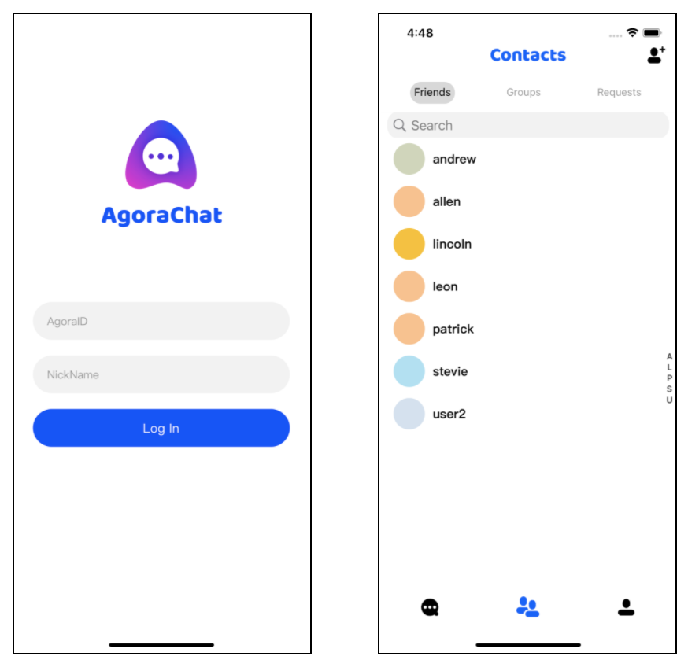

# 运行 即时通讯 IM UIKit Demo

## 概述

利用即时通讯 IM UIKit，你可以快速地将实时通讯嵌入你的 app，而无需在 UI 上进行其他操作。该 Demo 中包含利用即时通讯 IM 平台的示例项目、即时通讯 IM UIKit 以及用于构建和开发移动 app 的后端 API，提供以下即时通讯特性：

- 实时单聊、群聊和聊天室；
- 发送文件消息、图片消息、视频消息、音频消息和位置消息；
- 推送通知。




本页介绍如何运行示例项目.

## 前提条件

开始前，请确保满足以下条件：
- Xcode 11.0 或以上版本
- CocoaPods。若你尚未安装 CocoaPods，请参考 [CocoaPods 快速入门](https://guides.cocoapods.org/using/getting-started.html#getting-started)。

## 运行示例项目

按照以下步骤将即时通讯 IM UIKit 添加到你的项目中，并运行 demo。

1. 在你的本地设备上克隆该库。

   ```shell
   git clone git@github.com:AgoraIO-Usecase/AgoraChat-ios.git
   ```

2. 打开该项目的根路径，运行以下命令将 UIKit 添加到你的项目中：

   ```shell
   pod install
   ```

3. 运行以下命令打开项目：  
	Objective-C  
	```shell
	open AgoraChat.xcworkspace
	```
	Swift  
   	```shell
   	open AgoraChat-Swift.xcworkspace
   	```

4. 按住 `command + r` 键运行该项目。你会看到该 app 在模拟器中启动。

一切就绪！现在你可以运行该示例项目，探索即时通讯 IM UIKit 的特性了。

## 反馈

如果你对该示例项目有任何问题或建议，请提交问题。

## 参考

声网提交全套文档和 API 参考 [即时通讯 IM 文档](https://docs.agora.io/en/agora-chat/agora_chat_get_started_ios?platform=iOS)。

## 相关资源

- 如果遇到问题，请查看 [FAQ](./faq)，看看你的问题是否被提交过。
- 关于开发者社区管理的仓库，请查看 [Agora 社区](https://github.com/AgoraIO-Community)。
- 如果你在集成过程中遇到问题，请随时在 [Stack Overflow](https://stackoverflow.com/questions/tagged/agora.io) 中提出。

## 许可

基于 MIT 许可协议发布。如遇了解更多信息，请参阅 `许可协议`。
